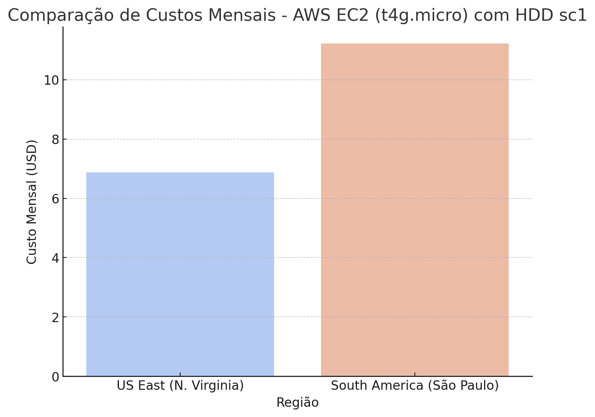
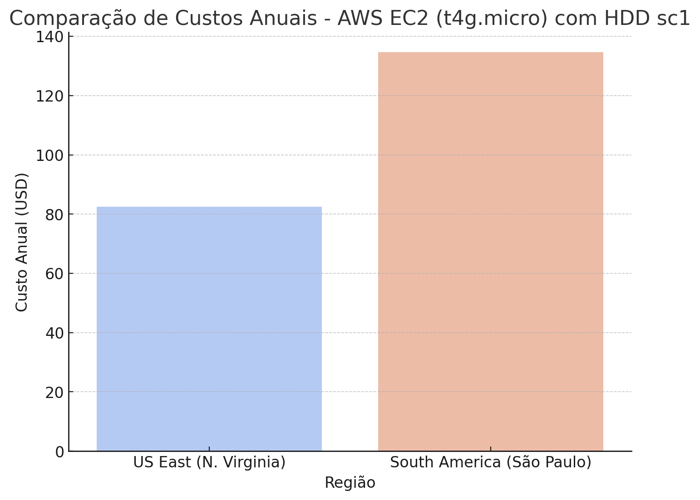

# FIAP - Faculdade de Informática e Administração Paulista

 

# FASE 5 - Cap 1 - Farmtech na Era da Cloud Computing

## Nome do grupo

## 👨‍🎓 Integrantes: 
- Gustavo Valtrick - RM559575
- Iago Cotta - RM559655
- Pedro Scofield - RM560589
- Rodrigo Mastropietro - RM560081
- Tiago de Andrade Bastos - RM560467

## 👩‍🏫 Professores:
### Tutor(a) 
- <a href="">Leonardo Ruiz Orabona</a>
### Coordenador(a)
- <a href="https://www.linkedin.com/in/profandregodoi/">André Godoi</a>

## 📜 Descrição

Este documento apresenta a análise de custos da AWS para hospedar nossa API de Machine Learning em duas regiões: US East (N. Virginia) e South America (São Paulo). Os cálculos foram feitos com a AWS Pricing Calculator, considerando uma instância EC2 e 50 GB de armazenamento (HD), conforme exigido pelo enunciado do projeto.

## 📂 Configuração Utilizada
- **Instância:** t4g.micro (ARM, opção mais econômica)
- **Sistema Operacional:** Linux
- **2 vCPUs, 1 GiB RAM**
- **Armazenamento:** 50 GB HDD (sc1)
- **On-Demand (100%)**

## 📊 Comparação de Custos
| Região                  | Custo Mensal (USD) | Custo Anual (USD) |
|------------------------|------------------|------------------|
| **US East (N. Virginia)**  | **$6.88**  | **$82.56**  |
| **South America (São Paulo)** | **$11.22**  | **$134.64**  |

## 📈 Análise e Insights
- **O custo em São Paulo é 63% maior do que em N. Virginia.**
- **A escolha de N. Virginia gera uma economia anual de $52.08 USD.**
- **Se não houver restrições legais, a hospedagem em N. Virginia é a melhor opção.**
- **Caso haja exigências para armazenamento no Brasil, o custo será consideravelmente mais alto.**

## 📉 Gráficos Comparativos
Aqui estão as representações visuais dos custos analisados:

### Link YouTube demonstrando funcionamento do projeto
- [Link para o vídeo não-listado](https://www.youtube.com/watch?v=I56b1w4DSRA)

## 📁 Estrutura de pastas

Dentre os arquivos e pastas presentes na raiz do projeto, definem-se:

- <b>.github</b>: Nesta pasta ficarão os arquivos de configuração específicos do GitHub que ajudam a gerenciar e automatizar processos no repositório.
- <b>assets</b>: aqui estão os arquivos relacionados a elementos não-estruturados deste repositório, como imagens.
- <b>document</b>: não utilizada nesse projeto
- <b>scripts</b>: não utilizada nesse projeto
- <b>src</b>: Todo o código fonte criado para o desenvolvimento do projeto.
- <b>README.md</b>: arquivo que serve como guia e explicação geral sobre o projeto (o mesmo que você está lendo agora).

## 🗃 Histórico de lançamentos

* 0.1.0 - 13/11/2024

## 📋 Licença

<a property="dct:title" rel="cc:attributionURL" href="https://github.com/agodoi/template">MODELO GIT FIAP</a> por <a rel="cc:attributionURL dct:creator" property="cc:attributionName" href="https://fiap.com.br">Fiap</a> está licenciado sobre <a href="http://creativecommons.org/licenses/by/4.0/?ref=chooser-v1" target="_blank" rel="license noopener noreferrer" style="display:inline-block;">Attribution 4.0 International</a>.

